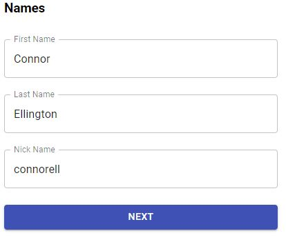

# Multi Step Form With React

[You can see screenshots of the messenger below](#screenshots)

## Install

1. `npm install` или `yarn install`
2. Run command `npm start` or `yarn start`.

## Build with:

**Frontend:**

- ReactJS + hooks
- Material-UI
- React-hooks-helper

## <a name="screenshots">Screenshots</a>

  <h3>Names</h3>
  
 
  <h3>Address</h3>
  
  
  <h3>Contacts</h3>
  
  
  <h3>Review accordion up</h3>
  
  
  <h3>Review accordion down</h3>
  

  <h3>Submit</h3>
  

